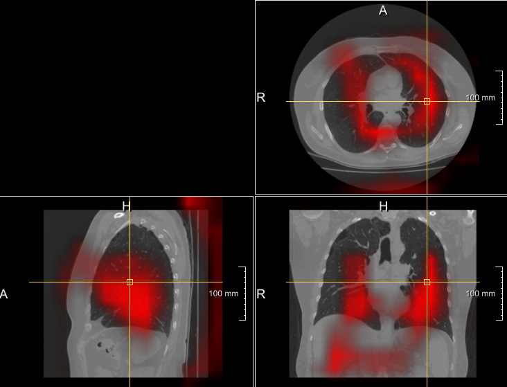

# A library that generates the 3D CAM attention maps for 3D networks for 3D medical images

## How to install it?
`pip install medcam3d`

This package is a 3D extension of **pytorch-grad-cam** https://github.com/jacobgil/pytorch-grad-cam. But at present, only **Grad-CAM** is supported. Other CAM implementations like Grad-CAM++ will be supported later once I have enough time. Also very welcome your pull request.

All the usage and configuration are the same as the original `pytorch-grad-cam` package. 

| Method              | What it does                                                                                                                |
|---------------------|-----------------------------------------------------------------------------------------------------------------------------|
| GradCAM             | Weight the 3D activations by the average gradient                                                                           |


# Chosing the Target Layer
You need to choose the target layer to compute CAM for.
Some common choices are:
- FasterRCNN: model.backbone
- Resnet18 and 50: model.layer4[-1]
- VGG and densenet161: model.features[-1]
- mnasnet1_0: model.layers[-1]
- ViT: model.blocks[-1].norm1
- SwinT: model.layers[-1].blocks[-1].norm1

If you pass **a list with several layers**, the CAM will be **averaged** accross them.
This can be useful if you're not sure what layer will perform best.
However, it may be not wise to select multiple layers at once because the CAMs's values of shallow layers may be way smaller than the deeper layers (e.g. 1/10). So the shallower layers' CAM would be ignored.

```
from medcam3d import GradCAM
from medcam3d.utils.model_targets import ClassifierOutputTarget
from medcam3d.utils.image import show_cam_on_image


model = resnet50(pretrained=True)  # your 3D network
target_layers = [model.layer4[-1]]  # normally the layer before the first fully connected layer
input_tensor = # Create an input tensor of 3D image for your model. Shape: (n_samples, n_channels, length, width, height)
# Note: input_tensor can be a batch tensor with several images! But Jingnan only tested the batch size of only 1.

# Construct the CAM object once, and then re-use it on many images:
cam = GradCAM(model=model, target_layers=target_layers, use_cuda=args.use_cuda)

# You can also use it within a with statement, to make sure it is freed,
# In case you need to re-create it inside an outer loop:
# with GradCAM(model=model, target_layers=target_layers, use_cuda=args.use_cuda) as cam:
#   ...

# We have to specify the target we want to generate
# the Class Activation Maps for.
# If targets is None, the highest scoring category
# will be used for every image in the batch.
# Here we use ClassifierOutputTarget, but you can define your own custom targets
# That are, for example, combinations of categories, or specific outputs in a non standard model.

targets = [ClassifierOutputTarget(281)]  # 281 could be replace by 0 or 1 for two-class classification.

# You can also pass aug_smooth=True and eigen_smooth=True, to apply smoothing.
cam_img = cam(input_tensor=input_tensor, targets=targets)  # output shape: (n_samples, length, width, height)

# In this example grayscale_cam has only one image in the batch:
cam_img = cam_img[0]  # output numpy array shape: (length, width, height)

# Then you can save the array as .mha file and visualize it in MeVisLab like the following figure.
```


----------

If this repository helps you in anyway, show your love ❤️ by putting a ⭐ on this project. 


